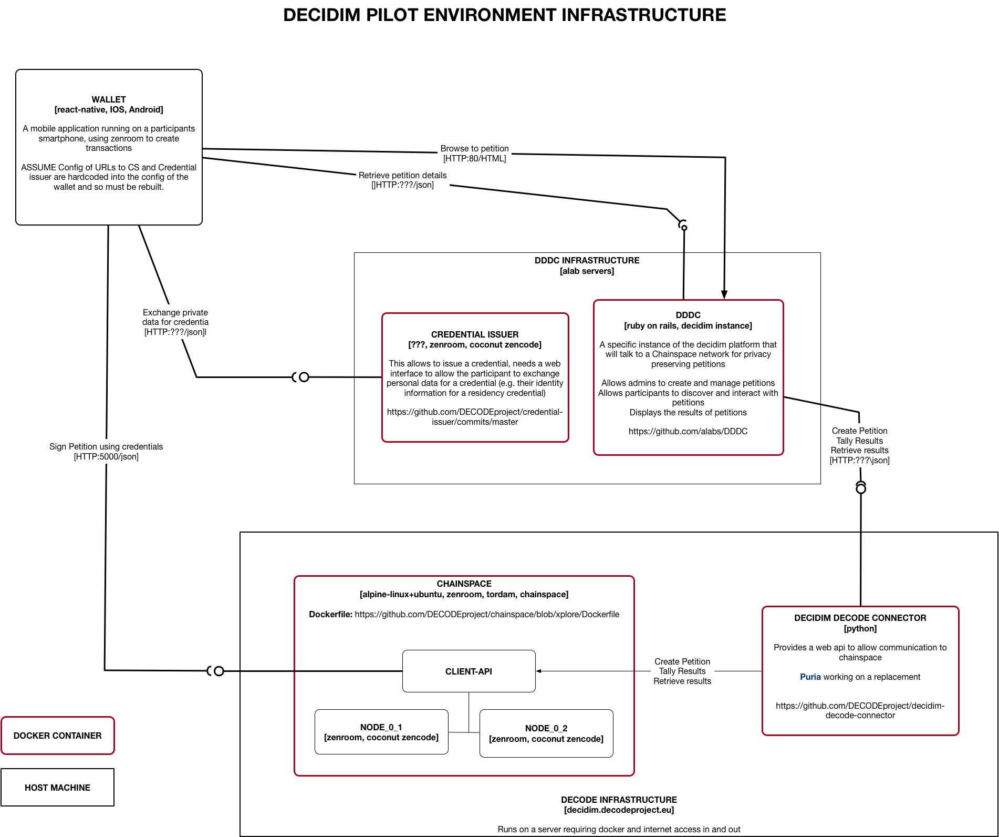

# Pilot Infrastructure - DECIDIM

This repository contains the [infrastructure as code](http://infrastructure-as-code.com/book/) that can create the infrastructure nescessary to support the [decidim](https://decodeproject.eu/pilots) pilot.

The infrastructure is relatively straightforward and is encoded using [docker compose](https://docs.docker.com/compose/), so the core requirement for the bas OS is that it supports docker.

In this initial version of the infrastructure, we are hosting everything on a single host instance. This is a practical measure for the early phases of the pilots to minimise the operational complexity of the infrastructure while we field test it.

The following diagram shows the layout of the architecture. The code inthis repo is concerned with the "DECODE Infrastructure" box.

[</img>](docs/infrastructure-overview.png)

The diagram shows the relevant docker containers and components and the publically accessible apis, along with the port numbers that need to be exposed.

The infrastructure is scripted with a simple bash script to provide some useful shortcuts to docker.

To bring an environment up follow these steps:

1. Install docker
2. Clone this repo
3. Type `./xec.sh init_docker` (Only need to do this once)
3. Type `./xec.sh up`

At the end it will print a status of the services. If you want to see whats running at any time, simply type `./xec.sh status`.

To stop everything, `./xec.sh down`

Enjoy.

